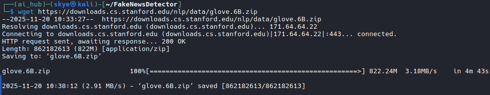

## Fake News Detection Model using TensorFlow in Python

Fake news is a type of misinformation that can mislead readers, influence public opinion, and even damage reputations. Detecting fake news prevents its spread and protects individuals and organizations. Media outlets often use these models to help filter and verify content, ensuring that the news shared with the public is accurate.

In this article we'll build a deep learning model using TensorFlow in Python to detect fake news from text.

---
### Project structure
```text
FakeNewsDetector
├── app.py
├── architecture_comparison.png
├── arch.py
├── checkpoints
│   └── model-best.h5
├── datasets
├── models
│   ├── model.keras
│   └── tokenizer.pkl
├── predict.py
├── preprocess.py
├── README.md
├── requirements.txt
├── src
│   ├── interface.png
│   └── Screenshot_20251120_103930.png
├── train.py
└── visualization.py
```

### Implementation of Fake News Detection Model

We will be building the model with following steps to make our model:
1. **Importing Libraries**

- The libraries we will be using are numpy, pandas, scikit learn and tenserflow

```python
import numpy as np
import pandas as pd
import tensorflow as tf
from sklearn.model_selection import train_test_split
from sklearn import preprocessing
from tensorflow.keras.preprocessing.text import Tokenizer
from tensorflow.keras.preprocessing.sequence import pad_sequences
```

2. **Importing the Dataset**

We will be using fake news dataset, which contains News text and corresponding label (FAKE or REAL). 
Dataset can be downloaded from this [dataset-source](https://media.geeksforgeeks.org/wp-content/uploads/20250319152540940977/news.csv).

```python
data = pd.read_csv("news.csv")
data.head()
```

3. **Preprocessing Dataset**
- As we can see the dataset contains one unnamed column. So we drop that column from the dataset.

```python
data = data.drop(["Unnamed: 0"], axis=1)
data.head(5)
```

Now that data is cleaned we can go for data encoding.
4. **Data Encoding**

- It converts the categorical column (label in out case) into numerical values.

[] `le.fit(data['label'])`: Fits the encoder on the 'label' column to learn the unique categories.
[-] `data['label'] = le.transform(data['label'])`: Transforms the categorical labels into numerical format (0 for REAL, 1 for FAKE).

```python
le = preprocessing.LabelEncoder()
le.fit(data['label'])
data['label'] = le.transform(data['label'])
```

5. **Variables Setup**

These are some variables required to be setup for the model training.
```python
embedding_dim = 50
max_length = 54
padding_type = 'post'
trunc_type = 'post'
oov_tok = "<OOV>"
training_size = 3000
test_portion = 0.1
```

6. **Tokenization**

This process divides a large piece of continuous text into distinct units or tokens. Here we use columns separately for a temporal basis as a pipeline just for good accuracy.

- `tokenizer1.fit_on_texts(title)`: Fits the tokenizer on the 'title' column to create a vocabulary.
- `pad_sequences(sequences1)`: Pads the sequences to ensure they all have the same length.

```python
title = []
text = []
labels = []
for x in range(training_size):
    title.append(data['title'][x])
    text.append(data['text'][x])
    labels.append(data['label'][x])

tokenizer1 = Tokenizer()
tokenizer1.fit_on_texts(title)
word_index1 = tokenizer1.word_index
vocab_size1 = len(word_index1)
sequences1 = tokenizer1.texts_to_sequences(title)
padded1 = pad_sequences(sequences1, padding=padding_type, truncating=trunc_type)
```

7. **Splitting Data for Training and Testing**
- `training_sequences1, test_sequences1`: Splits the tokenized and padded data into training and testing sets.
- `training_labels, test_labels`: Splits the corresponding labels into training and testing labels

```python
split = int(test_portion * training_size)
training_sequences1 = padded1[split:training_size]
test_sequences1 = padded1[0:split]
test_labels = labels[0:split]
training_labels = labels[split:training_size]
```

8. **Reshaping Data for LSTM**

We will be using LSTM(Long Short Term Memory) model for prediction and for that we need to reshape padded sequence. We are converting it into np.array() as we need training and test sequences into NumPy arrays which are required by TensorFlow models.
```python
training_sequences1 = np.array(training_sequences1)
test_sequences1 = np.array(test_sequences1)
```

9. **Generating Word Embedding**

Embeddings allows words with similar meanings to have a similar representation. Here each individual word is represented as real-valued vectors in a predefined vector space. For that we will be using glove.6B.50d.txt.

    !wget: Downloads the pre-trained GloVe embeddings from the following link.
    !unzip: Unzips the downloaded file containing the GloVe embeddings.

```bash
wget https://downloads.cs.stanford.edu/nlp/data/glove.6B.zip
unzip glove.6B.zip
```


Now that our glove embeddings are downloaded we can use them for word embedding.

```python
embedding_index = {}
with open('glove.6B.50d.txt', 'r', encoding='utf-8') as f:
    for line in f:
        values = line.split()
        word = values[0]
        coefs = np.asarray(values[1:], dtype='float32')
        embedding_index[word] = coefs
        
embedding_matrix = np.zeros((vocab_size1 + 1, embedding_dim))

for word, i in word_index1.items():
    if i < vocab_size1:
        embedding_vector = embedding_index.get(word)
        if embedding_vector is not None:
            embedding_matrix[i] = embedding_vector
```

10. **Model Architecture**

Here we use the TensorFlow embedding technique with Keras Embedding Layer where we map original input data into some set of real-valued dimensions.

**Embedding**: The embedding layer uses pre-trained GloVe embeddings.

**Conv1D**: A 1D convolutional layer to detect patterns in the text.

**LSTM(64)**: An LSTM layer to capture long-term dependencies in the data.

```python
model = tf.keras.Sequential([
    tf.keras.layers.Embedding(vocab_size1 + 1, embedding_dim, input_length=max_length, 
                              weights=[embedding_matrix], trainable=False),
    tf.keras.layers.Dropout(0.2),
    tf.keras.layers.Conv1D(64, 5, activation='relu'),
    tf.keras.layers.MaxPooling1D(pool_size=4),
    tf.keras.layers.LSTM(64),
    tf.keras.layers.Dense(1, activation='sigmoid')
])

model.compile(loss='binary_crossentropy', optimizer='adam', metrics=['accuracy'])
model.summary()
```

### Model Training
```text
Model: "sequential"
┏━━━━━━━━━━━━━━━━━━━━━━━━━━━━━━━━━━━━━━┳━━━━━━━━━━━━━━━━━━━━━━━━━━━━━┳━━━━━━━━━━━━━━━━━┓
┃ Layer (type)                         ┃ Output Shape                ┃         Param # ┃
┡━━━━━━━━━━━━━━━━━━━━━━━━━━━━━━━━━━━━━━╇━━━━━━━━━━━━━━━━━━━━━━━━━━━━━╇━━━━━━━━━━━━━━━━━┩
│ embedding (Embedding)                │ ?                           │         377,600 │
├──────────────────────────────────────┼─────────────────────────────┼─────────────────┤
│ dropout (Dropout)                    │ ?                           │               0 │
├──────────────────────────────────────┼─────────────────────────────┼─────────────────┤
│ conv1d (Conv1D)                      │ ?                           │     0 (unbuilt) │
├──────────────────────────────────────┼─────────────────────────────┼─────────────────┤
│ max_pooling1d (MaxPooling1D)         │ ?                           │               0 │
├──────────────────────────────────────┼─────────────────────────────┼─────────────────┤
│ lstm (LSTM)                          │ ?                           │     0 (unbuilt) │
├──────────────────────────────────────┼─────────────────────────────┼─────────────────┤
│ dense (Dense)                        │ ?                           │     0 (unbuilt) │
└──────────────────────────────────────┴─────────────────────────────┴─────────────────┘
 Total params: 377,600 (1.44 MB)
 Trainable params: 0 (0.00 B)
 Non-trainable params: 377,600 (1.44 MB)
 ```
 
